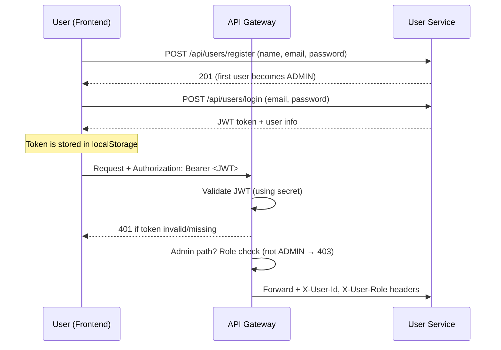
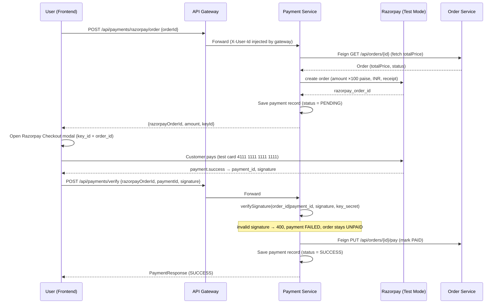
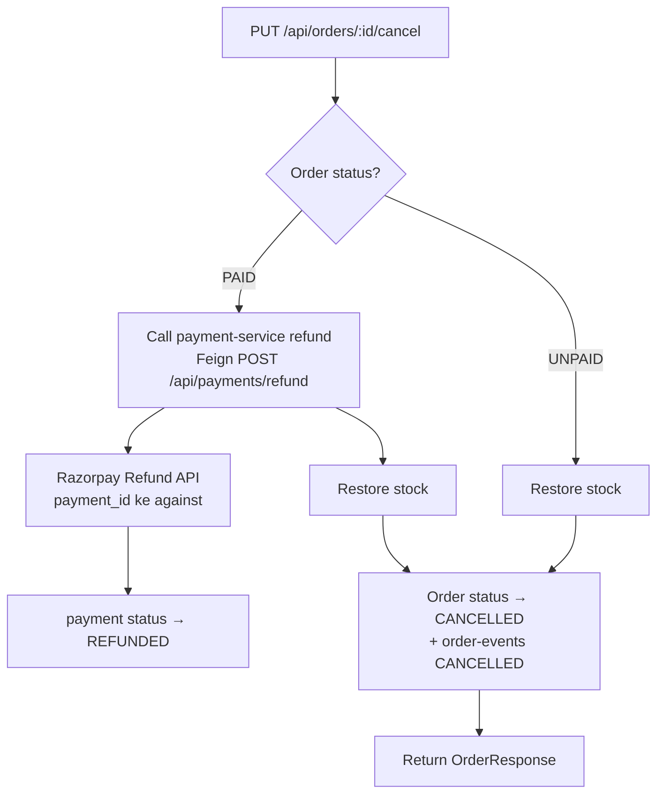
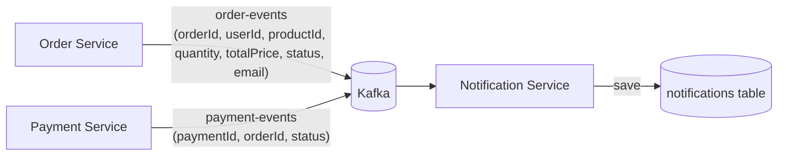
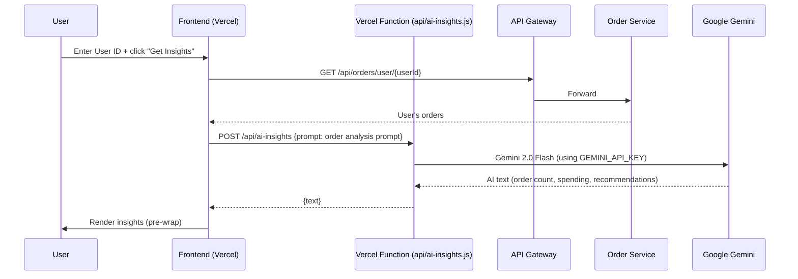
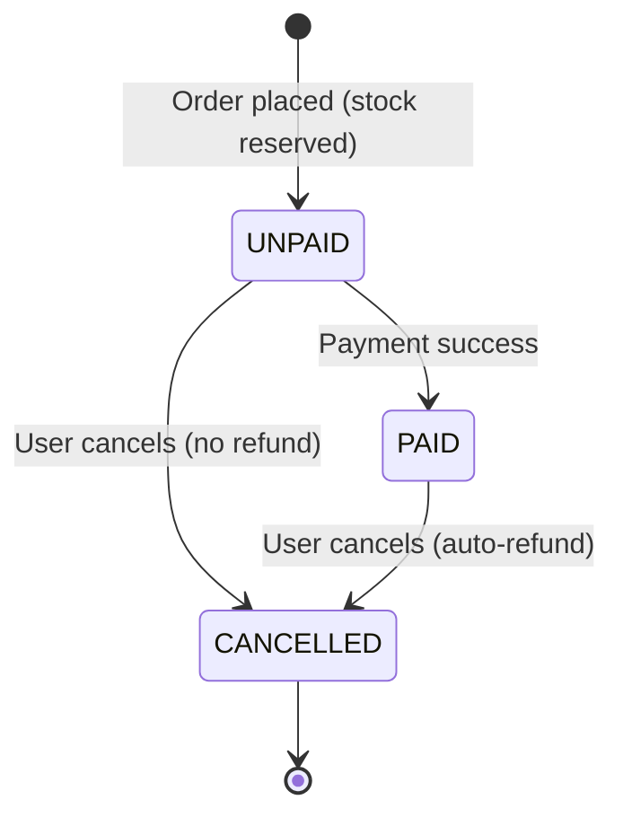

# OrderPulse — Complete Project Guide

OrderPulse is an **e-commerce order management system** built on a **microservices architecture**. This guide covers the full project structure, what each service does, every flow (order, payment, cancel, auth, AI), endpoints, database, and deployment.


---

## 1. What the Project Does

An order system where:

- A **user** logs in (JWT based)
- Can **view products**
- Places an **order** → the order is created as `UNPAID` (stock is reserved)
- Makes a **payment** (as a separate step) → order becomes `PAID`
- **Cancels** an order → if `PAID`, an **auto-refund** happens + stock is restored
- An **admin** manages users, products, orders, and payments
- The **AI Assistant** gives insights from a user's order history (powered by Gemini)

Everything is split into small, **independent services** that talk to each other over **HTTP (Feign)** and **Kafka events**.

---

## 2. Tech Stack

| Layer | Technology |
|---|---|
| Backend | Java 17, Spring Boot 3.3.3, Spring Cloud 2023.0.3 |
| Database | H2 (dev) / MySQL (prod) — each service has its own DB |
| Messaging | Apache Kafka (Confluent 7.6.1 via Docker) |
| Communication | OpenFeign (sync), Kafka (async events) |
| Resilience | Resilience4j (circuit breaker + rate limiter) |
| Caching | Caffeine (product-service) |
| Security | JWT (jjwt 0.12.6), Spring Security |
| Frontend | Vanilla HTML/CSS/JS (no framework) |
| AI | Google Gemini 2.0 Flash (Vercel serverless function) |
| Deployment | Render (backend) + Vercel (frontend) |

---

## 3. Architecture Diagram


**Important note:** A Eureka server exists, but no service actually registers with it — all services communicate via direct URLs (Feign `url` property). Eureka is just a dashboard right now.

---

## 4. Service Overview

| Service | Port | Purpose | Kafka |
|---|---|---|---|
| **api-gateway** | 8080 | Entry point for all requests. JWT validation, route forwarding, admin checks, injects `X-User-Id`/`X-User-Role` headers | — |
| **eureka-server** | 8761 | Service discovery dashboard (currently unused) | — |
| **user-service** | 8081 | Register/Login, JWT generation, user CRUD, roles | — |
| **product-service** | 8082 | Products + stock management, Caffeine cache, reduce/restore stock | — |
| **order-service** | 8083 | Order create/cancel, Saga orchestration, Kafka producer | Producer `order-events` |
| **payment-service** | 8084 | Payment processing (amount validation + mark order PAID), refunds | Producer `payment-events` |
| **notification-service** | 8085 | Kafka consumer → saves notification records (no REST API) | Consumer `order-events` + `payment-events` |

---

## 5. Auth Flow (JWT)



- Public paths (no token required): `register`, `login`, `/`
- All other paths require a token
- Admin-only: list users, change role, create/update products, list all orders, list all payments

---

## 6. Order Flow (Place Order → UNPAID)

Orders are **no longer immediately PAID** — first they are created as `UNPAID`, then the user makes a payment.


- Stock is **reserved** at this point (restored on cancel)
- If stock is insufficient → "Insufficient stock" error
- Resilience4j circuit breaker + rate limiter fallback returns an error if product-service is down

---

## 7. Payment Flow (UNPAID → PAID) — Razorpay Test Mode

Payment is processed through **Razorpay Test Mode**. Amount is always derived **server-side** from the order total (₹ → paise ×100), never trusted from the client.



- **Signature verification is backend-only** using Razorpay `key_secret` — a forged "success" from the client is rejected
- Keys never go to GitHub: `RAZORPAY_KEY_ID` / `RAZORPAY_KEY_SECRET` env vars
- If the user abandons checkout, the order stays `UNPAID` (stock still reserved) and they can retry or cancel
- Payment statuses: `PENDING` → `SUCCESS` / `FAILED`, and `REFUNDED` on refund

---

## 8. Cancel + Refund Flow

Cancellation works for both `UNPAID` and `PAID` orders. If the order is `PAID`, a **real Razorpay refund** happens first.



---

## 9. Kafka Events Flow



The notification message looks like: *"Order #5 is PAID. Thank you for your order!"*

> **Note:** Even if Kafka is down, the order flow still works — every `kafkaTemplate.send` is wrapped in try/catch (the event is just skipped and a warning is logged).

---

## 10. AI Assistant Flow



---

## 11. Order Status Lifecycle



Status values: `UNPAID` → `PAID` → `CANCELLED`

---

## 12. All REST Endpoints

### user-service (8081)
| Method | Path | Purpose | Auth |
|---|---|---|---|
| POST | `/api/users/register` | Register (first user becomes ADMIN) | Public |
| POST | `/api/users/login` | Login → JWT | Public |
| GET | `/api/users` | List all users | Admin |
| GET | `/api/users/{id}` | User profile | User |
| PUT | `/api/users/{id}` | Update name/email/password | User |
| PUT | `/api/users/{id}/role` | Change role | Admin |

### product-service (8082)
| Method | Path | Purpose | Auth |
|---|---|---|---|
| GET | `/api/products` | List products (cached) | User |
| GET | `/api/products/{id}` | Single product | User |
| POST | `/api/products` | Create product | Admin |
| PUT | `/api/products/{id}` | Update product | Admin |
| PUT | `/api/products/{id}/reduce` | Decrease stock (order flow) | Internal |
| PUT | `/api/products/{id}/restore` | Restore stock (cancel/compensation) | Internal |

### order-service (8083)
| Method | Path | Purpose | Auth |
|---|---|---|---|
| POST | `/api/orders` | Create order → UNPAID | User |
| GET | `/api/orders` | List all orders | Admin |
| GET | `/api/orders/{id}` | Single order | User |
| GET | `/api/orders/user/{userId}` | User's orders | User |
| PUT | `/api/orders/{id}/pay` | Mark PAID (from payment-service) | Internal |
| PUT | `/api/orders/{id}/cancel` | Cancel (+refund if PAID) | User |

### payment-service (8084)
| Method | Path | Purpose | Auth |
|---|---|---|---|
| POST | `/api/payments/razorpay/order` | Create Razorpay order (server-side amount, paise) → PENDING | User |
| POST | `/api/payments/verify` | Verify HMAC signature → mark order PAID, payment SUCCESS | User |
| POST | `/api/payments/refund` | Real Razorpay refund (cancel flow) | Internal |
| GET | `/api/payments` | List all payments | Admin |

### notification-service (8085)
- **No REST endpoints** — it is only a Kafka consumer

---

## 13. Database Entities

Each service has its **own database** (H2 in dev / MySQL in prod).

### users (user-service)
`id` | `name` | `email` (unique) | `password` (BCrypt) | `role` (USER/ADMIN) | `createdAt`

### products (product-service)
`id` | `name` | `description` | `price` (BigDecimal) | `quantity` (Integer)

### orders (order-service)
`id` | `userId` | `productId` | `quantity` | `totalPrice` (BigDecimal) | `status` (UNPAID/PAID/CANCELLED) | `createdAt`

### payments (payment-service)
`id` | `orderId` | `userId` | `razorpayOrderId` | `paymentId` | `signature` | `method` | `amount` (BigDecimal) | `currency` (INR) | `status` (PENDING/SUCCESS/FAILED/REFUNDED) | `createdAt` | `updatedAt`

### notifications (notification-service)
`id` | `orderId` | `email` | `message` | `sentAt`

> There is no DB relationship (foreign key) between Order → User/Product — they are just `userId`/`productId` long values. This follows the microservice pattern where each service owns its data.

---

## 14. Frontend Pages (Vercel)

| Page | Purpose |
|---|---|
| `index.html` | Login/Register + Dashboard (stats for users, products, orders, payments) |
| `users.html` | User list, Make Admin, Add User, Login-as |
| `products.html` | Product list, Add/Edit (visible to ADMIN only) |
| `orders.html` | User's orders, Create New Order, Cancel |
| `payments.html` | Process Payment (order → PAID), Refund |
| `ai-assistant.html` | Smart Order Assistant (Gemini insights) |

- **Auth:** token + user info stored in `localStorage`. API calls send `Authorization: Bearer <token>`
- **API base:** `http://localhost:8080` locally, relative path in production (`vercel.json` rewrites)
- Files: `js/api.js` (central fetch wrapper), `js/*.js` (page logic), `css/style.css`

---

## 15. Running Locally

**Prerequisites:** Java 17, Maven, Docker (for Kafka).

```bash
# 1. Start Kafka + Zookeeper (Docker)
docker-compose up -d

# 2. Start all services + frontend
./start-all.sh          # Linux/macOS
# or
start-all.bat           # Windows
```

- `start-all.sh` starts eureka → 6 services → frontend (port 5500); all logs go to `logs/`
- Open: `http://localhost:5500`
- Works even without Kafka (notifications just won't be created)
- Stop: `./stop-all.sh`

---

## 16. Deployment (Render + Vercel)

### Render (backend — 6-7 web services)
Each service lives in its own folder (each folder has a `Dockerfile`). Deploy each service as a separate web service on Render (root directory = the service folder).

### Vercel (frontend)
Root directory = `frontend/`. In `vercel.json`, `/api/*` requests are rewritten to the Render gateway.

### Environment Variables (required)

**api-gateway:**
| Key | Value |
|---|---|
| `USER_SERVICE_URL` | `https://<user-service>.onrender.com` |
| `PRODUCT_SERVICE_URL` | `https://product-service-148n.onrender.com` |
| `ORDER_SERVICE_URL` | `https://<order-service>.onrender.com` |
| `PAYMENT_SERVICE_URL` | `https://payment-service-owgc.onrender.com` |
| `NOTIFICATION_SERVICE_URL` | `https://<notification-service>.onrender.com` |

**order-service:**
| Key | Value |
|---|---|
| `PRODUCT_SERVICE_URL` | `https://product-service-148n.onrender.com` |
| `PAYMENT_SERVICE_URL` | `https://payment-service-owgc.onrender.com` |

**payment-service:**
| Key | Value |
|---|---|
| `ORDER_SERVICE_URL` | `https://<order-service>.onrender.com` |
| `RAZORPAY_KEY_ID` | Test-mode key from Razorpay Dashboard → Settings → API Keys |
| `RAZORPAY_KEY_SECRET` | Test-mode secret (never expose to frontend) |

**user-service:**
| Key | Value |
|---|---|
| `JWT_SECRET` | Any 32+ char secret string |

> Spring relaxed binding: the `product-service.url` property is set from the env var `PRODUCT_SERVICE_URL`.

**frontend (Vercel):**
| Key | Value |
|---|---|
| `GEMINI_API_KEY` | API key from Google AI Studio |

---

## 17. Known Issues / Notes

1. **Eureka unused** — no service registers with it; everything uses direct URLs
2. **No Kafka on Render** — `spring.kafka.bootstrap-servers=localhost:9092` is the default, so notifications don't get created in the deployed environment. A managed Kafka (Aiven/CloudKarafka) would fix this
3. **Hardcoded email** — order-service sends `email: "user@example.com"` in events; the real user email is never fetched from user-service
4. **No tests** — there is no test code in any service
5. **Distributed transaction gap** — order-service has Feign calls inside `@Transactional`, so if any step fails, there can be a stock/order inconsistency (compensation currently only exists for payment-failure/cancel)
6. **Dockerfile `EXPOSE 8080`** is hardcoded (actual ports 8081-8085 come from the `PORT` env var)
7. **No cart** — one order has one product + quantity (no multi-item cart support)

---

## 18. Quick Request Example

```bash
# Login
curl -X POST http://localhost:8080/api/users/login \
  -H "Content-Type: application/json" \
  -d '{"email":"admin@orderpulse.com","password":"admin123"}'

# Place order (UNPAID)
curl -X POST http://localhost:8080/api/orders \
  -H "Content-Type: application/json" \
  -H "Authorization: Bearer <TOKEN>" \
  -d '{"userId":1,"productId":1,"quantity":2}'

# Pay with Razorpay (Test Mode) → PAID
# Step 1: create razorpay order (amount is derived server-side)
curl -X POST http://localhost:8080/api/payments/razorpay/order \
  -H "Content-Type: application/json" \
  -H "Authorization: Bearer <TOKEN>" \
  -d '{"orderId":1}'
#   → { razorpayOrderId: "order_...", amount: 90000.0, keyId: "rzp_test_..." }

# Step 2: in the browser, open Razorpay checkout with that razorpayOrderId + keyId,
# pay with test card 4111 1111 1111 1111, then verify with the signature:
curl -X POST http://localhost:8080/api/payments/verify \
  -H "Content-Type: application/json" \
  -H "Authorization: Bearer <TOKEN>" \
  -d '{"razorpayOrderId":"order_...","paymentId":"pay_...","signature":"<signature-from-razorpay>"}'
#   → PaymentResponse (status: SUCCESS), order becomes PAID
```

---

That's it! If you need more detail on any flow, just ask — I can explain with the actual code. 🚀
