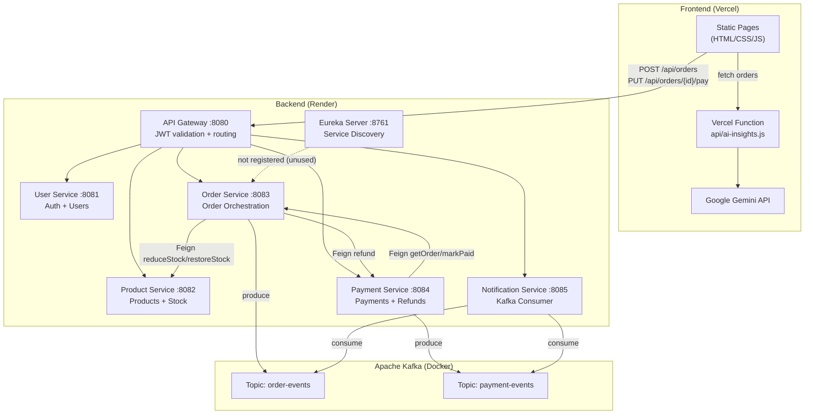
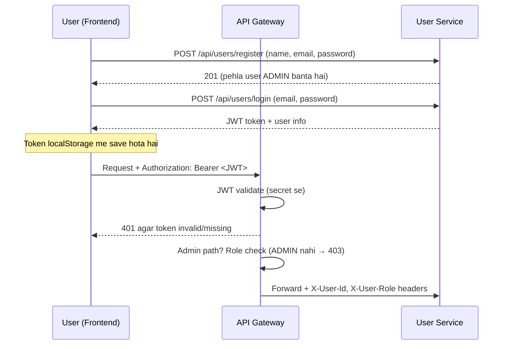
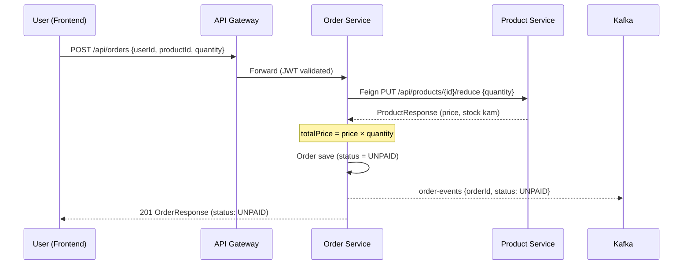
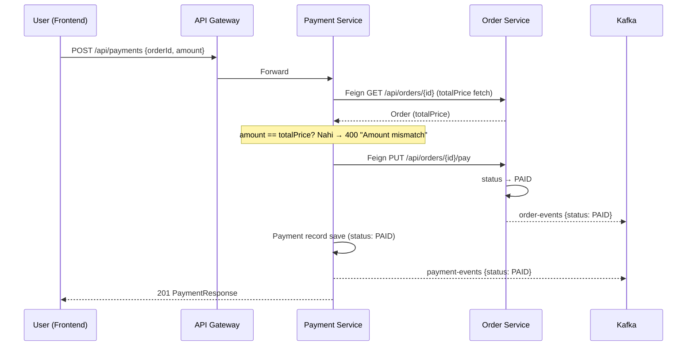
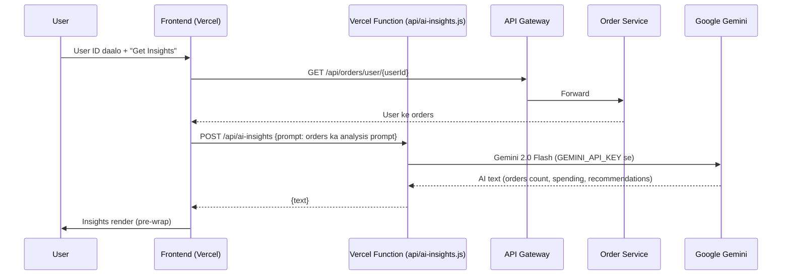
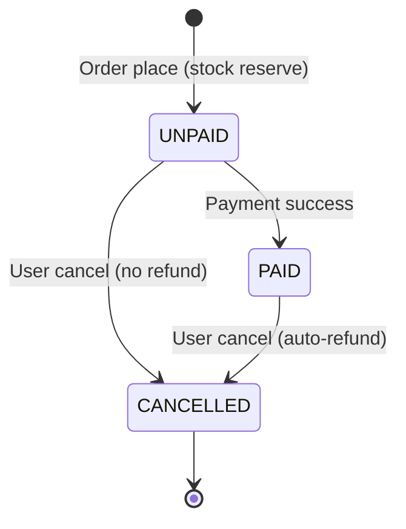

# OrderPulse — Complete Project Guide (Hinglish)

OrderPulse ek **e-commerce order management system** hai jo **microservices architecture** par bana hai. Iss guide me project ka poora structure, har service ka kaam, saare flows (order, payment, cancel, auth, AI), endpoints, database, deployment — sab kuch hai.

> Default login: `admin@orderpulse.com` / `admin123`

---

## 📌 1. Project Kya Hai

Ek order system jisme:

- **User** login karta hai (JWT se)
- **Products** dekh sakta hai
- **Order** place karta hai → order `UNPAID` banta hai (stock reserve)
- **Payment** karta hai (alag step) → order `PAID` ho jata hai
- **Order cancel** karta hai → PAID ho to **auto-refund** + stock wapas
- **Admin** users/products/orders/payments manage karta hai
- **AI Assistant** user ke order history se insights deta hai (Gemini se)

Sab cheezein chhote-chhote **independent services** me split hain jo ek dusre se **HTTP (Feign)** aur **Kafka events** se baat karti hain.

---

## 🛠 2. Tech Stack

| Layer | Technology |
|---|---|
| Backend | Java 17, Spring Boot 3.3.3, Spring Cloud 2023.0.3 |
| Database | H2 (dev) / MySQL (prod) — har service ka apna DB |
| Messaging | Apache Kafka (Confluent 7.6.1 via Docker) |
| Communication | OpenFeign (sync), Kafka (async events) |
| Resilience | Resilience4j (circuit breaker + rate limiter) |
| Caching | Caffeine (product-service) |
| Security | JWT (jjwt 0.12.6), Spring Security |
| Frontend | Vanilla HTML/CSS/JS (koi framework nahi) |
| AI | Google Gemini 2.0 Flash (Vercel serverless function) |
| Deployment | Render (backend) + Vercel (frontend) |

---

## 🏗 3. Architecture Diagram



**Ek important note:** Eureka server hai, par koi service usme register nahi karti — saare services direct URLs se communicate karte hain (Feign `url` property). Eureka bas ek dashboard hai abhi.

---

## 🧩 4. Services ka Introduction

| Service | Port | Kaam | Kafka |
|---|---|---|---|
| **api-gateway** | 8080 | Sab requests ka entry point. JWT validate, routes forward, admin check, `X-User-Id`/`X-User-Role` headers inject | — |
| **eureka-server** | 8761 | Service discovery dashboard (abhi koi use nahi karta) | — |
| **user-service** | 8081 | Register/Login, JWT generate, users CRUD, roles | — |
| **product-service** | 8082 | Products + stock management, Caffeine cache, reduce/restore stock | — |
| **order-service** | 8083 | Order create/cancel, Saga orchestration, Kafka producer | Producer `order-events` |
| **payment-service** | 8084 | Payment process (amount validate + order mark PAID), refund | Producer `payment-events` |
| **notification-service** | 8085 | Kafka consume → notification record save (koi REST API nahi) | Consumer `order-events` + `payment-events` |

---

## 🔐 5. Auth Flow (JWT)



- Public paths (bina token): `register`, `login`, `/`
- Baaki sab paths par token chahiye
- Admin-only: list users, change role, create/update products, list all orders, list all payments

---

## 🛒 6. Order Flow (Place Order → UNPAID)

Ab order **immediately PAID nahi hota** — pehle `UNPAID` banta hai, phir user payment karta hai.



- Stock abhi **reserve** hota hai (cancel par wapas)
- Aggar stock kam ho → "Insufficient stock" error
- Resilience4j circuit breaker + rate limiter fallback error deta hai agar product-service down ho

---

## 💳 7. Payment Flow (UNPAID → PAID)

Payment user **Payments page** se karta hai — order ID + amount bhar ke.



- **Amount validation** payment-service karta hai — order ki total se match na ho to error
- Payment ke baad hi order `PAID` hota hai

---

## ❌ 8. Cancel + Refund Flow

Cancel **UNPAID** aur **PAID** dono par ho sakta hai. PAID ho to pehle **refund** hota hai.

```mermaid
flowchart TD
    A[PUT /api/orders/{id}/cancel] --> B{Order status?}
    B -->|UNPAID| C[Stock restore]
    B -->|PAID| D[payment-service refund call<br/>Feign POST /api/payments/refund]
    D --> E[Stock restore]
    C --> F[Order status → CANCELLED<br/>+ order-events CANCELLED]
    E --> F
    F --> G[Response OrderResponse]
```

---

## 📨 9. Kafka Events Flow

```mermaid
flowchart LR
    OS["Order Service"] -->|order-events<br/>{orderId, userId, productId, quantity, totalPrice, status, email}| KAFKA[(Kafka)]
    PMS["Payment Service"] -->|payment-events<br/>{paymentId, orderId, status}| KAFKA
    KAFKA --> NS["Notification Service"]
    NS -->|save| DB[(notifications table)]
```

Notification message banata hai jaise: *"Order #5 is PAID. Thank you for your order!"*

> **Note:** Kafka down ho to bhi order flow chalta hai — saare `kafkaTemplate.send` try/catch me hain (bas event skip ho jata hai + log me warning).

---

## 🤖 10. AI Assistant Flow



---

## 📊 11. Order Status Lifecycle



Status values: `UNPAID` → `PAID` → `CANCELLED`

---

## 📡 12. All REST Endpoints

### user-service (8081)
| Method | Path | Kaam | Auth |
|---|---|---|---|
| POST | `/api/users/register` | Register (pehla user ADMIN) | Public |
| POST | `/api/users/login` | Login → JWT | Public |
| GET | `/api/users` | List all users | Admin |
| GET | `/api/users/{id}` | User profile | User |
| PUT | `/api/users/{id}` | Update name/email/password | User |
| PUT | `/api/users/{id}/role` | Role change | Admin |

### product-service (8082)
| Method | Path | Kaam | Auth |
|---|---|---|---|
| GET | `/api/products` | List products (cached) | User |
| GET | `/api/products/{id}` | Single product | User |
| POST | `/api/products` | Create product | Admin |
| PUT | `/api/products/{id}` | Update product | Admin |
| PUT | `/api/products/{id}/reduce` | Stock kam (order flow) | Internal |
| PUT | `/api/products/{id}/restore` | Stock wapas (cancel/compensation) | Internal |

### order-service (8083)
| Method | Path | Kaam | Auth |
|---|---|---|---|
| POST | `/api/orders` | Create order → UNPAID | User |
| GET | `/api/orders` | List all orders | Admin |
| GET | `/api/orders/{id}` | Single order | User |
| GET | `/api/orders/user/{userId}` | User ke orders | User |
| PUT | `/api/orders/{id}/pay` | Mark PAID (payment-service se) | Internal |
| PUT | `/api/orders/{id}/cancel` | Cancel (+refund agar PAID) | User |

### payment-service (8084)
| Method | Path | Kaam | Auth |
|---|---|---|---|
| POST | `/api/payments` | Process payment (validate + mark PAID) | User |
| GET | `/api/payments` | List all payments | Admin |
| POST | `/api/payments/refund` | Refund (cancel flow) | Internal |

### notification-service (8085)
- **Koi REST endpoint nahi** — sirf Kafka consumer hai

---

## 🗄 13. Database Entities

Har service ka **apna DB** hota hai (H2 dev / MySQL prod).

### users (user-service)
`id` | `name` | `email` (unique) | `password` (BCrypt) | `role` (USER/ADMIN) | `createdAt`

### products (product-service)
`id` | `name` | `description` | `price` (BigDecimal) | `quantity` (Integer)

### orders (order-service)
`id` | `userId` | `productId` | `quantity` | `totalPrice` (BigDecimal) | `status` (UNPAID/PAID/CANCELLED) | `createdAt`

### payments (payment-service)
`id` | `orderId` | `amount` (BigDecimal) | `status` (PAID/REFUNDED) | `createdAt`

### notifications (notification-service)
`id` | `orderId` | `email` | `message` | `sentAt`

> Order → User/Product ka koi DB relation (foreign key) nahi — sirf `userId`/`productId` long values hain. Microservice pattern me services apna data alag rakhne ke liye.

---

## 🌐 14. Frontend Pages (Vercel)

| Page | Kaam |
|---|---|
| `index.html` | Login/Register + Dashboard (users, products, orders, payments ki stats) |
| `users.html` | User list, Make Admin, Add User, Login-as |
| `products.html` | Product list, Add/Edit (ADMIN ko hi dikhta hai) |
| `orders.html` | User ke orders, Create New Order, Cancel |
| `payments.html` | Process Payment (order → PAID), Refund |
| `ai-assistant.html` | Smart Order Assistant (Gemini insights) |

- **Auth:** token + user info `localStorage` me. API calls `Authorization: Bearer <token>` bhejte hain
- **API base:** localhost par `http://localhost:8080`, production me relative path (`vercel.json` rewrites)
- Files: `js/api.js` (central fetch wrapper), `js/*.js` (page logic), `css/style.css`

---

## 🚀 15. Local Run Karna

**Prerequisite:** Java 17, Maven, Docker (Kafka ke liye).

```bash
# 1. Kafka + Zookeeper start karo (Docker)
docker-compose up -d

# 2. Saare services + frontend start karo
./start-all.sh          # Linux/macOS
# ya
start-all.bat           # Windows
```

- `start-all.sh` → eureka → 6 services → frontend (port 5500) start karta hai, sab logs `logs/` me
- Open: `http://localhost:5500`
- Bina Kafka ke bhi chalta hai (bas notifications nahi banenge)
- Stop: `./stop-all.sh`

---

## ☁️ 16. Deploy (Render + Vercel)

### Render (backend — 6-7 web services)
Har service apne folder me hai (har folder ke andar `Dockerfile`). Render par har service alag web service me deploy karo (root directory = service folder).

### Vercel (frontend)
Root directory = `frontend/`. `vercel.json` me `/api/*` ko Render gateway par rewrite hota hai.

### ⚙️ Environment Variables (zaroori)

**api-gateway:**
| Key | Value |
|---|---|
| `USER_SERVICE_URL` | `https://<user-service>.onrender.com` |
| `PRODUCT_SERVICE_URL` | `https://product-service-148n.onrender.com` |
| `ORDER_SERVICE_URL` | `https://<order-service>.onrender.com` |
| `PAYMENT_SERVICE_URL` | `https://payment-service-owgc.onrender.com` |
| `NOTIFICATION_SERVICE_URL` | `https://<notification-service>.onrender.com` |

**order-service:**
| Key | Value |
|---|---|
| `PRODUCT_SERVICE_URL` | `https://product-service-148n.onrender.com` |
| `PAYMENT_SERVICE_URL` | `https://payment-service-owgc.onrender.com` |

**payment-service:**
| Key | Value |
|---|---|
| `ORDER_SERVICE_URL` | `https://<order-service>.onrender.com` |

> Spring relaxed binding: `product-service.url` property env var `PRODUCT_SERVICE_URL` se set hoti hai.

**frontend (Vercel):**
| Key | Value |
|---|---|
| `GEMINI_API_KEY` | Google AI Studio ka API key |

---

## ⚠️ 17. Known Issues / Notes

1. **Eureka unused** — koi service register nahi karti, sab direct URLs use karte hain
2. **Kafka Render par nahi** — `spring.kafka.bootstrap-servers=localhost:9092` default hai, isliye deployed par notifications nahi bante. Managed Kafka (Aiven/CloudKarafka) se fix hoga
3. **Email hardcoded** — order-service event me `email: "user@example.com"` hardcoded hai, user ka real email user-service se fetch nahi hota
4. **No tests** — kisi service me test code nahi hai
5. **Distributed transaction gap** — order-service me Feign calls `@Transactional` ke andar hain, isliye agar kabhi koi step fail ho to stock/order me inconsistency ho sakti hai (compensation abhi sirf payment-failure/cancel ke liye hai)
6. **Dockerfile EXPOSE 8080** hardcoded hai (actual ports 8081-8085 env se aate hain)
7. **Payment simulated** — koi real payment gateway nahi (Razorpay/Stripe) — bas record + status update hota hai
8. **No cart** — ek order me ek product + quantity (multi-item order support nahi)

---

## 📊 18. Quick Request Example

```bash
# Login
curl -X POST http://localhost:8080/api/users/login \
  -H "Content-Type: application/json" \
  -d '{"email":"admin@orderpulse.com","password":"admin123"}'

# Place order (UNPAID)
curl -X POST http://localhost:8080/api/orders \
  -H "Content-Type: application/json" \
  -H "Authorization: Bearer <TOKEN>" \
  -d '{"userId":1,"productId":1,"quantity":2}'

# Pay (sahi amount se → PAID)
curl -X POST http://localhost:8080/api/payments \
  -H "Content-Type: application/json" \
  -H "Authorization: Bearer <TOKEN>" \
  -d '{"orderId":1,"amount":300000.00}'
```

---

That's it! Agar kisi flow ke baare me aur detail chahiye ho — bolo, main code dikha kar samjhaunga. 🚀
